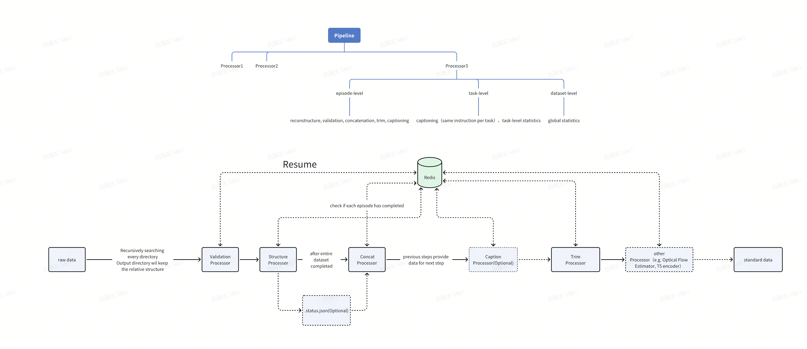

# Embodied Data Toolkit


**Embodied Data Toolkit** is an end-to-end framework designed for Embodied AI and robotics learning. It provides a complete solution from raw data ingestion and format conversion to high-level trajectory processing.

The toolkit consists of two core components:
1.  **Unified Data Converter**: A configuration-driven engine to transform heterogeneous raw data (HDF5, Pytorch Tensor, Json, mp4, etc.) into any designated formats.
2.  **Process Pipeline**: A modular workflow manager for trajectory processing (Trimming, Captioning, Concatenation) with built-in checkpointing.

---

## 🏗️ Architecture

The framework adopts a layered processing architecture to ensure high throughput and reliability.



### 1. Unified Data Converter (Format Engine)
- **No-Code Mapping**: Define source-to-target mapping via JSON configs without writing code.
- **Protocol Support**: Native support for `src://` (source root) and `dest://` (target root) protocols.
- **Multimedia Expert**: Extract compressed videos from HDF5, merge tensors, and handle multi-modal data.
- **Advanced Aggregation**: Capable of querying and aggregating data across logical levels (e.g., gathering all episodes for a task summary).

### 2. Process Pipeline (Workflow Manager)
- **Multi-level Concurrency**: Parallel processing at Episode, Task, and Dataset levels using `multiprocessing`.
- **Resumable Execution**: Crash-safe processing using Redis and local `.status.json` files to track progress.
- **Pluggable Steps**: Built-in processors for **Validation**, **Structure**, **Concat**, **Caption**, and **Trim**.

---

## 🚀 Quick Start

### 1. Installation
```bash
git clone https://github.com/thu-ml/embodied-data-toolkit.git
cd embodied-data-toolkit

conda create -n embodied-data-toolkit python==3.10
conda activate embodied-data-toolkit

pip install -r requirements.txt
# Ensure system-level ffmpeg is installed
# sudo apt install ffmpeg
```

### 2. Component Usage

#### A. Data Conversion
Convert raw datasets to a standard structure using a JSON config (define your corresponding config json first):
```bash
python unified_data_converter/run_conversion.py \
    --config unified_data_converter/configs/my_config.json \
    --src_root /path/to/raw_data \
    --dest_root /path/to/standard_data \
    --workers 16
```

or

```bash
bash scripts/run_conversion.sh
```


#### B. Trajectory Processing
Run the high-level processing pipeline (Trimming, Captioning, etc.), change `config.yaml` and add more Processors to adapt to your own process pipeline:
```bash
python process_pipeline/process_pipeline.py \
  --config process_pipeline/configs/config.yaml
```

or

```bash
bash scripts/run_process_pipeline.sh
```

---

## 📂 Standard Data Format

The toolkit assumes a standardized directory structure for trajectory data to ensure compatibility between different processors and models. This format is the target of the **Unified Data Converter** and the input for the **Process Pipeline**.

```text
{task_name}/
├── task_meta.json           # Global metadata and task-level instructions
└── episode_{id}/            # Individual episode directory
    ├── video.mp4            # Main/Merged video (result of Concat processor, with cam_high.mp4 at top, cam_left_wrist.mp4 at bottom left(resized to half height and width of cam_high.mp4) and cam_right_wrist.mp4 at bottom right(resized to half height and width of cam_high.mp4))
    ├── qpos.pt              # Joint positions and gripper states (torch.Tensor)
    ├── endpose.pt           # End-effector Cartesian poses (Optional, torch.Tensor)
    ├── instructions.json    # Language metadata (total_frames, instructions, segments)
    ├── umt5_wan/            # (Optional, just as an example to exemplify how to add extra information into our data format) Language embeddings (UMT5/Wan2.2)
    └── raw_video/           # Original camera views
        ├── cam_high.mp4     # Fixed high-angle view (e.g., top/rear)
        ├── cam_left_wrist.mp4
        ├── cam_right_wrist.mp4
        └── cam_front.mp4    # (Optional) Front/Side view
```

### Key Data Specifications
- **Tensors**: `.pt` files are expected to be saved via `torch.save()`.
- **Videos**: `.mp4` files should ideally be H.264 encoded for maximum compatibility.
- **Instructions**: `instructions.json` should contain at least a top-level `instructions` list of strings and frame-level sub-instructions.

```
{
  instructions: ["aaa","bbb","ccc"],
  sub_instructions: [
    {"start_frame": 0, "end_frame": 150, "instruction": ["aaa"]},
    {"start_frame": 150, "end_frame": 340, "instruction": ["bbb", "ccc"]}
  ]
}
```

---

## 🛠️ Redis Management

The **Process Pipeline** uses Redis to maintain a global state for breakpoint resumption (checkpointing).

### Installation (Linux/Ubuntu)
```bash
sudo apt update
sudo apt install redis-server
```

### Starting Redis
- **As a System Service (Recommended)**:
  ```bash
  sudo systemctl start redis-server
  # Enable auto-start on boot
  sudo systemctl enable redis-server
  ```
- **Manually in Background**:
  ```bash
  redis-server --daemonize yes
  ```

### Stopping Redis
- **As a System Service**:
  ```bash
  sudo systemctl stop redis-server
  ```
- **Manually**:
  ```bash
  redis-cli shutdown
  ```

### Checking Status
```bash
redis-cli ping
# Should return "PONG"
```

---

## 🧩 Processors Detail (partial)

| Component | Processor | Description | Key Parameters |
| :--- | :--- | :--- | :--- |
| **Pipeline** | **Validation** | Verifies data integrity and compliance | `perform: true` |
| **Pipeline** | **Structure** | Restructures directory hierarchy | `fast_video_copy` |
| **Pipeline** | **Concat** | Merges multi-view videos (Top/Left/Right) | `fps` |
| **Pipeline** | **Caption** | Generates text descriptions (GPT/VLM) | `api_key`, `system_prompt` |
| **Pipeline** | **Trim** | Trims static frames based on movement | `threshold`, `video_trim_mode` |
| **Converter** | **copy** | Simple file copy | `source` |
| **Converter** | **hdf5_extractor** | Extract data from HDF5 files | `source_h5`, `fields` |
| **Converter** | **json_transformer** | Transform JSON structure | `template` |

---

## 📂 Project Structure

```text
.
├── unified_data_converter/   # Format conversion engine
│   ├── configs/              # JSON conversion rules
│   ├── core/                 # Resolver, Planner, Context
│   ├── processors/           # HDF5, Video, JSON converters
│   └── run_conversion.py     # Entry point
├── process_pipeline/         # Workflow & Trajectory manager
│   ├── configs/              # Pipeline YAML configs
│   ├── core/                 # Pipeline & Runners (Episode/Task)
│   ├── processors/           # Trim, Caption, Concat steps
│   └── process_pipeline.py   # Entry point
├── utils/                    # Shared IO, Video, and Tensor utilities
└── README.md
```

---

## ⚠️ Notes

1.  **Concurrency**: Both components support the `--workers` or `workers` config to adjust CPU usage.
2.  **Trim Mode**: 
    - `ffmpeg`: High quality, slow.
    - `fast` (OpenCV): High speed (8-10x), larger files.
3.  **HDF5 Dependencies**: If using `hdf5_extractor`, ensure `h5py` is installed.
